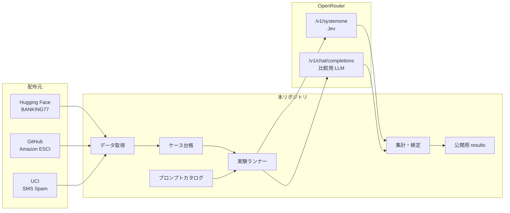
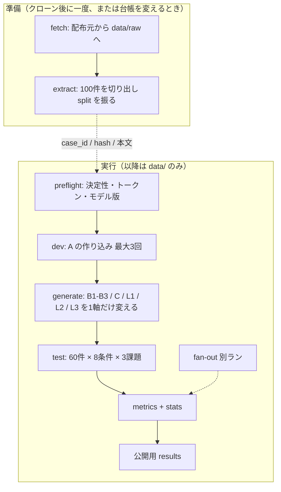
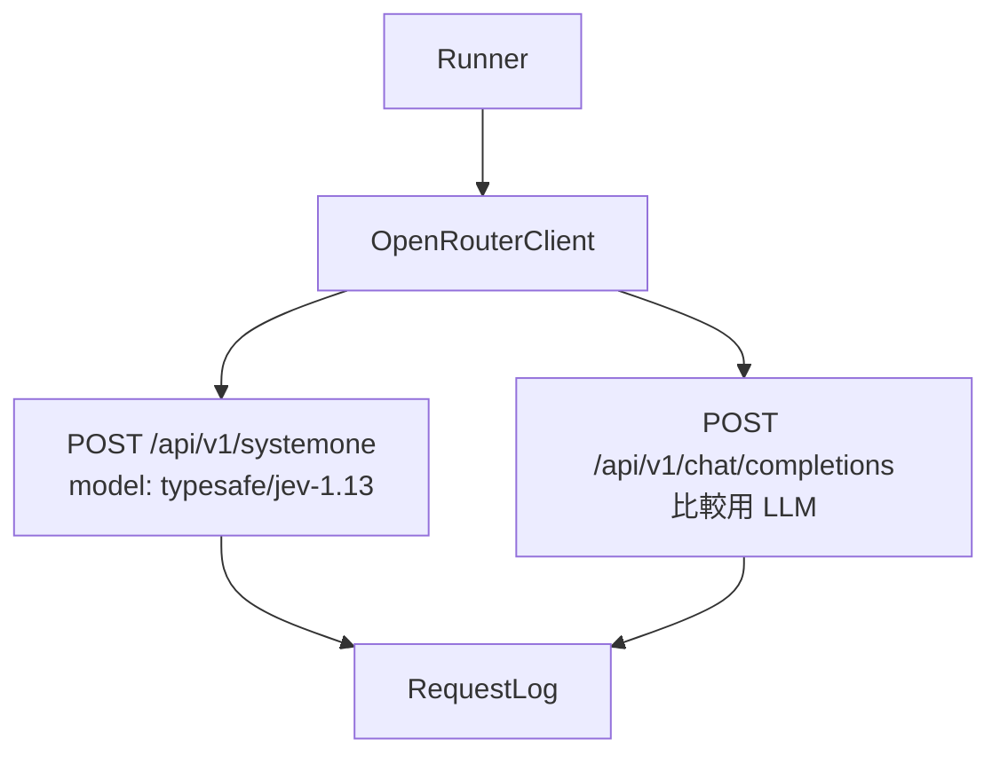

# アーキテクチャ

Jev プロンプト実験の実装地図。実験の仮説・条件・指標の正本は
[評価設計書](docs/source-of-truth/design-of-evaluation.md) にあり、この文書はそれを
**コードとディレクトリに落とすときの境界**だけを定める。

プロンプト作法そのものは [jev-prompt-guide](docs/source-of-truth/jev-prompt-guide.md)、
データセット選定は [ADR-0001](docs/adr/datasets.md)、比較用 LLM は
[ADR-0002](docs/adr/competitor-llm.md)、ライセンスの帰属は
[DATA_LICENSES.md](DATA_LICENSES.md) を正本とする。

## 1. 目的と範囲

目的は、Jev の性能を引き出すプロンプト作法が、公開データ上で精度と confidence に
どれだけ効くかを再現可能な実験として走らせ、数値で報告することである。

このリポジトリが担うのは次の 4 つに限る。実験結果を把握する手段は **markdown を読むこと** である。
入口は CLI（Typer）。Web UI やノートブックを開かせない。図が要る箇所は画像ファイルを
作り、markdown から参照する。作図ライブラリは問わない。

1. 公開データセットからケースを抽出し、同一サブセットを再現できること
2. 3 課題 × 8 条件の入力（state / questions、または LLM プロンプト）を組み立てること
3. Jev と比較用 LLM に投げ、1 リクエスト 1 行で再集計可能なログを残すこと
4. 事前宣言した指標で集計・検定し、`results/` の markdown（必要なら埋め込み画像）を出すこと

学習・ファインチューン・モデル配布は範囲外。データセット本文は同梱しない。

## 2. コンテキスト

推論の出口は **OpenRouter だけ**にする。Jev も比較用 LLM も同じベース URL と
同じ API キーで足り、TypeSafe 直叩きや TypeSafe SDK は使わない。



- 資格情報は OpenRouter のキー 1 本。Podman secret 経由でのみ渡す。
  リポジトリ・ログ・results に置かない。
- Jev は Chat Completions では呼べない。`state` と typed `questions`
  （`choice` / `score` / `noul`）を `POST https://openrouter.ai/api/v1/systemone`
  に送る。モデル ID は `typesafe/jev-1.13` に固定し、`~typesafe/jev-latest` は使わない。
- 比較用 LLM（L1 / L2 / L3）は同じホストの Chat Completions。モデル ID は
  L1 / L2 が `openai/gpt-5.6-luna`（GPT-5.6 Luna、provider は OpenAI）、
  L3 が `anthropic/claude-sonnet-5`（Claude Sonnet 5、provider は Anthropic）。
  L3 は L2 のプロンプトを固定してモデルだけ変える。エイリアスは使わない。
  プロバイダは `order` で固定し、`allow_fallbacks` は false、
  `require_parameters` は true、`data_collection` は deny。
  実応答のモデル名とプロバイダをログに残す。
- レスポンスの `model` は OpenRouter 側の正規名（例: `typesafe/jev-1.13-20260917`）
  で記録する。事前確認でパッチバージョンを固定したことになる。
- TypeSafe の非公開ドキュメント・料金情報は顧客契約上の機密であり、
  本リポジトリの公開物に含めない。公開されている OpenRouter のモデルページと
  評価設計書だけを参照する。

## 3. 論理コンポーネント

実装は「課題セット 3 式が並ぶ」のではなく、**共通パイプライン + 課題プラグイン**にする。
実行単位が「ケースごとに 8 条件を連続実行」であるため、課題ごとに独立した実行系を
持つと条件間比較の同時性が崩れる。

| コンポーネント | 責務 | 課題固有か |
| --- | --- | --- |
| ケース台帳 | 配布元から取得、100 件抽出、dev/test 分割、ID と本文ハッシュの永続化 | 抽出ロジックのみ固有 |
| プロンプトカタログ | 条件 A〜C / L1 / L2 / L3 の questions または LLM テンプレート | 中身は固有、読み出しは共通 |
| 状態ビルダ | ケース本文から state を組む。条件 C だけノイズを足す | ノイズの中身は固有 |
| OpenRouter クライアント | 1 クライアント、2 エンドポイント。再試行しない | 共通 |
| 実験ランナー | ケース順に全条件を連続実行し、1 リクエスト 1 行を書く | 共通 |
| 事前確認 | 決定性・トークン上限・パッチバージョン記録 | 共通 |
| 指標 | Choice / Score / Noul の主指標・副指標と共通 4 指標 | 計算式は固有 |
| 検定 | 対応あり比較（McNemar、ブートストラップ、Holm） | 共通 |
| 公開結果 | 入力本文を除いた測定値を markdown にし、図表は画像としてそこに含める | 共通 |

課題プラグインが実装するインタフェースは次で足りる。

- ケースの抽出と gold の写像
- 条件ごとの questions（または LLM メッセージ）
- クリーンな state と、条件 C 用のノイズ付き state
- 主指標・副指標の計算

## 4. 実験の不変条件

評価設計の核は「軸を混ぜない」ことである。プロンプト組み立てはこの規則をコードで
固定し、テストで守る。

| 条件 | 動かしてよい軸 | 固定する軸 |
| --- | --- | --- |
| A | —（基準） | — |
| B1 / B2 / B3 | questions のみ（それぞれ instructions+criteria / criteria / instructions） | state は A と同一 |
| C | state のみ（ノイズ追加） | questions は A と同一 |
| L1 / L2 | バックエンド・出力形式・プロンプト文体 | ケース本文と gold |
| L3 | モデルのみ | L2 のプロンプト、ケース本文と gold |

ランナーが守ること。

- 同じケースを全条件に流す（対応のある比較）。
- 実行順は課題 → 条件 → ケースではなく、**ケースごとに全条件を連続**。
- A の改訂は dev 40 件のみ。報告数値は test 60 件のみ。改訂は最大 3 回、ログ必須。
- 投機的 fan-out は精度比較と同一ランに入れない。A の質問群を「1 回にまとめる /
  n 回に分割する」別ランとし、コスト・遅延・一致率だけを比べる。
  まとめて 1 回のログは `data/logs/fanout-batched.jsonl`、分割して n 回のログは
  `data/logs/fanout-split.jsonl`。本ランの `eval.jsonl` やその集計には混ぜない。

合格ライン、仮説 H1〜H4、指標の定義は設計書の事前宣言をそのまま使う。
結果を見てから指標を足さない。

## 5. データ準備と実行パイプライン

配布元からの取得は実験ランに含めない。ケース集合は台帳で先に固定し、本文は
ローカルに保存しておく。ランナーは `data/` だけを読み、Hugging Face / GitHub / UCI
には触れない。本文が無ければ失敗する（暗黙の再取得はしない）。



Git に入るのは台帳（`case_id`、split、gold、content_hash、抽出シード）だけである。
本文は `data/raw/` に置き、コミットしない。別マシンで再現するときは fetch を
再実行し、ハッシュが台帳と一致することを確認する。

事前確認で失敗したら本ランに進まない。

- モデルを `typesafe/jev-1.13` に固定し、レスポンスの `model`（パッチ付き）を記録する
- 条件 C と課題 1 の A（77 選択肢）がトークン上限を超えないこと。
  OpenRouter 掲載のコンテキストは 32k なので、その値で事前確認する
- 10 件を 2 回実行し、同一入力で出力が一致すること。一致しなければ全条件 3 回実行して平均

見積もりリクエスト数は設計書どおり、本ラン 2,400（Jev 1,500 / LLM 900）、
LLM ばらつき測定で +3,600（3 条件 × 3 課題 × 100 ケース × 追加 4 回。
主測定 temperature 0 の 1 回に加え、既定温度で 5 回反復するため）。
fan-out はこれに含めない。

## 6. ディレクトリとライセンス境界

ライセンスはディレクトリで切る（[01-seed](docs/source-of-truth/01-seed.md)）。
REUSE の SPDX 識別子をファイルに付け、`reuse lint` で検証する。

```text
.
├── src/jev_prompts/          MIT
│   ├── config/               パス・モデル名・閾値。秘匿情報は置かない
│   ├── data/                 台帳の読み書き、スキーマ。表は Polars
│   ├── prompts/              prompts/ 配下を読む。条件の1軸差分を検証可能にする
│   ├── clients/              OpenRouter（systemone と chat completions）
│   ├── runners/              本ランと fan-out、事前確認
│   ├── metrics/              課題タイプ別指標と共通4指標
│   ├── stats/                McNemar / bootstrap / Holm
│   └── report/               results/ へ markdown と埋め込み用画像を書く
├── prompts/                  CC0-1.0  人が読むプロンプトの正本
│   ├── choice/
│   ├── score/
│   ├── noul/
│   └── llm/
├── scripts/                  MIT  Typer の薄い入口。fetch / run_eval / run_fanout
│                             本体は `python -m jev_prompts`（fetch / preflight / run / fanout）
├── tests/                    MIT  ライブ API を既定の CI に含めない
├── data/                     Git 管理外（本文）。台帳メタデータのみ追跡対象
│   ├── raw/                  配布元の展開物
│   └── cases/                case_id, split, gold, content_hash
├── results/                  CC BY 4.0  測定値のみ。入力本文を置かない
└── docs/
    ├── source-of-truth/      人間のみ編集
    ├── adr/
    └── statistical-methods.md  検定の解説（高校範囲）
```

`prompts/` は実験条件の正本であり、`src/` はそれを読むだけにする。
条件の差分を Python でその場生成すると、設計書と実装が分岐する。

`data/cases/*.jsonl` に置いてよいのはケース ID、split、gold、本文ハッシュ、
抽出シードまで。本文は `data/raw/` に置き、`.gitignore` する。
公開用 `results/` も本文を持たない。再集計用のフルログ（`state_json` /
`question_json` を含む）は `data/logs/` に置き、コミットしない。
公開行は `PublishedRecord`（本文キーなし）だけを `results/` に書く。

## 7. データモデル

ランナーと集計が共有する最小の型。

```text
TaskId        = choice | score | noul
ConditionId   = A | B1 | B2 | B3 | C | L1 | L2 | L3
Split         = dev | test

Case
  case_id, task, split, gold, content_hash
  text fields are loaded from data/raw at runtime

PromptBundle
  condition, questions | llm_messages
  (C は questions を A から参照する)

RequestLog          # 1 リクエスト 1 行。再集計の正本（ローカル）
  case_id, task, condition, split
  model, provider, request_id
  routing_json             # provider.order / allow_fallbacks / require_parameters / data_collection
  state_json, question_json
  answer               # choice | score | noul
  probabilities, confidence
  usage_tokens, latency_ms
  gold, error

PublishedRecord     # results/ に書く行。本文なし
  RequestLog minus state_json, question_json
  plus content_hash
```

`probabilities` は全件必須。Score は `score` を丸めず連続値のまま MAE を取り、
同じ 1.0 でも分布が違う場合を後から読むため。

gold の写像は課題側に閉じる。

| 課題 | データセット | gold |
| --- | --- | --- |
| Choice | BANKING77 | 意図ラベル（77 + 条件 A のみ `other`） |
| Score | Amazon ESCI（英語） | I=0, C=1, S=2, E=3（KDD Cup の gain 順。ADR-0001） |
| Noul | SMS Spam Collection | spam = yes, ham = no |

抽出は課題あたりランダム 50 + 境界 50。gold で層化し、各クラスが dev / test の
両方に入る。境界の定義（混同ペア、S/C ペア、紛らわしい ham）は設計書に従う。

## 8. 依存の向き

Import Linter で一方向に固定する。下の層は上を import しない。

```text
report → stats → metrics → runners → prompts → clients → data → config
```

- `clients` は OpenRouter の HTTP 以外の実験知識を持たない。TypeSafe SDK は依存に入れない。
- `metrics` は API を呼ばない。`RequestLog` と gold だけを見る。
- `prompts`（コード）はカタログファイルを読む。`runners` より下に置き、
  ランナーが組み立て規則を再実装しないようにする。
- `scripts/` は Typer の薄い入口であり、逆方向の import は禁止。サブコマンドの中身は `jev_prompts` に置く。
- 台帳・ログ・集計の表の正本は Polars にする。pandas を第二の表スタックとして足さない。
  検定や作図が配列を求めるときだけ変換する。

複雑度ゲート（Radon / Xenon）の閾値は `pyproject.toml` に固定する。
緩める変更は CODEOWNERS のレビュー対象。

## 9. 推論アダプタ

プロンプトカタログは JSON で `state` / `questions` を持つ。実行時に TypeSafe の
Python クラスへ載せ替える必要はない。



共通。

- ベース URL は `https://openrouter.ai/api`。認証は `Authorization: Bearer` に
  環境変数 `OPENROUTER_API_KEY` だけを付ける。リポジトリに置かない。
- Jev は `POST /api/v1/systemone`。比較用 LLM は `POST /api/v1/chat/completions`。
  Jev を Chat Completions の URL に送らない。
- ライブラリは HTTP クライアント 1 本で足りる。OpenAI 互換 SDK を LLM 用に
  足してもよいが、Jev を Chat Completions クライアントに流し込まない。
- OpenRouter には Decisions API（`POST /api/alpha/decisions`）もある。実験は
  評価設計と同じペイロードの v1 System One に寄せ、alpha は使わない。

Jev（条件 A〜C）。

- ボディは `{ "model", "state", "questions" }`。`questions` の各要素は
  `type` / `instructions` / `criteria`。
- 応答は型付きの `choice` / `score` / `noul` と、Choice・Score では
  `probabilities` / `confidence`。Noul に confidence フィールドは無い
  （`noul` 値そのものが分布）。
- モデル ID は `typesafe/jev-1.13`。エイリアスは向き先が変わり得る。
- 主測定は 1 回。事前確認で非決定なら 3 回平均。
- 例外は `error` に記録し、そのケースは当該条件を失敗として集計する。再試行しない。

LLM（条件 L1 / L2 / L3）。

| 条件 | モデル | モデル ID | provider.order | プロンプト |
| --- | --- | --- | --- | --- |
| L1 | GPT-5.6 Luna | `openai/gpt-5.6-luna` | OpenAI | タスク 1 文 + ラベル一覧 + 「ラベル名だけ返せ」 |
| L2 | GPT-5.6 Luna | `openai/gpt-5.6-luna` | OpenAI | 役割、A の criteria の散文化、混同ペア、JSON スキーマ、few-shot 3 件 |
| L3 | Claude Sonnet 5 | `anthropic/claude-sonnet-5` | Anthropic | L2 と同一（モデルだけ変える） |

呼び出しは全条件で次を付ける。付けないと測定対象がプロンプトではなくルーティングになる。

- `provider.allow_fallbacks`: false（既定の true のままでは `order` は希望にすぎない）
- `provider.require_parameters`: true（false だと構造化出力非対応エンドポイントでスキーマが無視される）
- `provider.data_collection`: deny
- 主測定は temperature 0、`seed` は `20260921`。ばらつき測定は既定温度で 5 回
- `~openai/gpt-luna-latest` のようなエイリアスは使わない

出力は `{"label": "…", "confidence": 0.0-1.0}`。パース失敗は不正解、再試行なし。
77 意図を毎回送るため、プロンプトキャッシュあり/なしのコストを両方記録する。
A と L2 の作成時間を記録し、工数を揃えたことをレポートに書く。

比較の公平性はランナーではなくカタログと記録の問題である。L2 をコード生成の
省略形にしない。

## 10. 指標と報告物

計算は実行前に固定する。課題タイプの主指標・副指標と、全タイプ共通の 4 指標
（confident 誤答率、較正 / ECE、1,000 件あたりコスト、p50 / p95 レイテンシ）は
設計書の表を実装する。合格ラインも設計書の事前宣言をコードのアサーションにはせず、
レポートの判定欄にだけ使う（差が小さいこと自体が報告対象だから）。

検定は対応あり前提。独立 2 標本は使わない。

### 統計

判定と区間の出し方は、次の 3 手法に分ける。ライブラリの使い方ではなく、何を判定するか、なぜ対応のある比較と補正が要るかは [docs/statistical-methods.md](docs/statistical-methods.md) を読む。

- **McNemar**: 同じケースを 2 条件で見たときの当たり外れの差を見る。例は条件 A 対 条件 B1。
- **ブートストラップ**: 再標本で正答率などの指標の区間を出す。
- **Holm**: 同じデータで A 対 B1、A 対 B2 のように何度も検定するときの補正である。

読む対象は `results/report.md` である。本文は結果を見て書き、コマンドでは作らない。
`python -m jev_prompts report`（薄い入口は `scripts/write_report.py`）が書くのは
`results/tables.md` と図だけであり、`report.md` は上書きしない。
設計書が求める 3 種は、Polars で組んだ表に加え、作図ライブラリで出した図である。
ライブラリは固定しない。表と図は `tables.md` と `results/figures/` に置き、
報告に載せる数値と読みは `report.md` に写す。

1. 課題ごとの条件 × 指標マトリクス（信頼区間付き）
2. 条件別の較正（10 ビンの表と reliability diagram 画像。ECE を併記）
3. 条件ごとのコストと精度（表と散布図画像）

図ファイルは `results/` 配下に置き、本文は含めない。A の誤答は全件目視分類する。
これはコードの自動出力ではなく、レポート執筆手順。目視結果も同じ markdown に節を足す。

## 11. 品質ゲートと CI

| ツール | 見るもの |
| --- | --- |
| uv | 依存解決。`uv pip` は使わない |
| pytest | 抽出の再現、1 軸差分、指標の既知例、ログスキーマ |
| Ruff | lint / format |
| Import Linter | 8 節のレイヤ |
| Radon / Xenon | 複雑度 |
| reuse lint | SPDX と LICENSE ファイルの対応 |

CI は上の静的検証とユニットテストまで。有料 API を叩く本ランは CI に載せない。
JavaScript 側は `pnpm exec biome ci .`。`results/figures/` の SVG は対象外。
ワークフローを追加したら README 先頭付近に状況バッジを出す。

複雑度ゲート（Xenon / Radon）の閾値は `pyproject.toml` の `[tool.xenon]` が正本。
ブロックが閾値より悪い rank になると CI が失敗する。緩める変更は CODEOWNERS 対象。

| 項目 | 閾値 | 落ちる条件 |
| --- | --- | --- |
| `max_absolute` | C | いずれかのブロックが D 以上（循環的複雑度 21 以上） |
| `max_modules` | B | いずれかのモジュールが C 以上（同 11 以上） |
| `max_average` | A | 平均が B 以上（同 6 以上） |

対象パスは `src` / `scripts` / `tests`。報告だけ見るときは `uv run radon cc -s src scripts tests`。

ユニットテストで必ず固定する例。

- 同一シードでケース ID 集合が一致する
- B2 の questions は A と instructions が同一で criteria だけ違う（課題ごとに）
- C の questions は A と同一で state だけキーが増える
- Score の MAE は `score` を丸めない
- Noul の AUC は反転補正せず生値で出す
- `PublishedRecord` に本文フィールドが無い

## 12. 実行環境と秘匿情報

- 言語: Python。パッケージマネージャは uv。`uv pip` は使わない。
- CLI は Typer。`argparse` で入口を増やさない。
- 表は Polars。ログの読み書きと条件ごとの集計に使う。
- コードが読む資格情報は環境変数 `OPENROUTER_API_KEY` だけである。
  リポジトリに置かない。`.env` は gitignore 済みで、ローダは無い。
  TypeSafe 用の秘匿情報は持たない。
- Containerfile / Dockerfile はリポジトリに無い。コンテナで包むときの受け渡しは
  `podman secret` で同じ環境変数へ載せる想定だが、イメージ定義は同梱していない。
- ホストに残るフルログは個人情報（SMS 本文など）を含み得る。公開前に
  `results/` へ本文なしで書き出す経路以外を配付しない。

## 13. 意図的にやらないこと

- 日本語評価を本ランに混ぜること。言語効果と作法の効果が分離できない。
  追試するなら課題を 1 つに限り、英英 / 日英 / 日日の 3 条件で同じケースを使う。
- データセット本文・フルログの Git 管理。
- `~typesafe/jev-latest` および TypeSafe 直の `jev-latest` への追従。
  途中で向き先が変わり得る。
- 比較用 LLM の `-latest` エイリアス、およびプロバイダ未固定
  （`allow_fallbacks: true`）での呼び出し。
- `api.typesafe.ai` への直接呼び出し、および TypeSafe SDK への依存。
- Jev を Chat Completions で呼ぶこと。OpenRouter 上でも Decisions / System One 専用である。
- ライブ API を含むテストをデフォルト CI にすること。
- Web UI、HTML ダッシュボード、ノートブックを結果の閲覧手段にすること。
  図はファイルに出し、markdown からリンクする。作図ライブラリは問わない。
- 表の正本を pandas にし、Polars と併用すること。
- 指標の事後追加。増やす場合は設計書側の変更を Issue で人間に依頼してから。

## 14. 参照

- [仕様草案](docs/source-of-truth/01-seed.md)
- [評価設計書](docs/source-of-truth/design-of-evaluation.md)
- [統計手法の解説](docs/statistical-methods.md)
- [プロンプト作法](docs/source-of-truth/jev-prompt-guide.md)
- [ADR-0001 データセット選定](docs/adr/datasets.md)
- [ADR-0002 比較対象とする LLM の選定](docs/adr/competitor-llm.md)
- [データセットのライセンス](DATA_LICENSES.md)
- [REUSE Specification 3.3](https://reuse.software/spec-3.3/)
- [OpenRouter: Jev 1.13](https://openrouter.ai/typesafe/jev-1.13)
- [OpenRouter: GPT-5.6 Luna](https://openrouter.ai/openai/gpt-5.6-luna)
- [OpenRouter: Claude Sonnet 5](https://openrouter.ai/anthropic/claude-sonnet-5)
- [OpenRouter: TypeSafe SDK 互換](https://openrouter.ai/docs/guides/community/typesafe-sdk)
