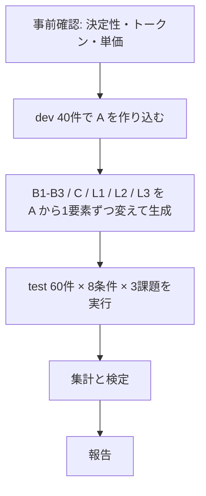

# Jev プロンプト評価 設計書

## 目的と仮説

この評価は、Jev 向けのプロンプト作法が公開データ上でどれだけ精度と confidence に効くかを数値で出す。効果が小さければ作法を必須にしない、という判断まで含める。

事前に立てる仮説は4つ。結果はこの4つに対する支持・棄却として報告する。

| # | 仮説 | 判定に使う指標 |
| --- | --- | --- |
| H1 | 曖昧な指示一文にすると、Jev 用に書いた場合より精度が落ちる | 条件 A と B1 の主指標の差（test） |
| H2 | 失敗モードによって効き方の大きさが違う | 条件 B2・B3・C それぞれの A からの低下幅 |
| H3 | confidence は誤答の予測子として使える。良いプロンプトほど「確信度が高い誤答」が少ない | confident 誤答率、reliability diagram |
| H4 | 良いプロンプトの Jev は、素朴な LLM と同等以上の精度をより低いコストと遅延で出す | 精度差、1,000件あたりコスト、p95 レイテンシ |

結果が出たら次を決める。

- H1 の効果量 → 社内でプロンプト作法をレビュー必須にするか
- H2 の順位 → 限られたレビュー工数をどの作法に割くか
- H3 → confidence ゲートの閾値をどこに置くか
- H4 → Jev に寄せてよいワークロードの範囲

## 実験デザイン

3課題 × 8条件 × 100ケースの完全要因配置。同じケースを全条件に流す対応のある比較にする。

条件は良いプロンプト A から**1要素だけ**を壊して作る。そうしないと「悪いプロンプトは悪かった」以上の結論が出ない。

| ID | 条件 | A から変えるもの | 対応する失敗モード |
| --- | --- | --- | --- |
| A | Jev 作法に沿ったプロンプト | —（基準） | — |
| B1 | 曖昧な指示 | instructions を曖昧な1文に、criteria は名前のみ | Literal reading、複数判断の混在 |
| B2 | criteria の欠陥 | criteria のみ（課題ごとに定義） | 選択肢の重複、程度語段階、条件の AND 結合 |
| B3 | instructions の欠陥 | instructions のみ | Indirection、多次元化、criteria との矛盾 |
| C | state ノイズ | state のみ（questions は A と同一） | Large state full of irrelevant detail |
| L1 | LLM 素朴 | モデルと出力形式 | — |
| L2 | LLM 整備 | プロンプト | — |
| L3 | LLM 整備 | L2 のプロンプトを固定してモデルだけ変える | — |

軸を混ぜないことがこの設計の核。A〜B3 は state を完全に固定して questions だけを動かす。C は逆に questions を A と同一にして state だけを膞らませる。

ケースは dev 40件 / test 60件に分ける。A の作り込みと改訂は dev だけで行い、報告する数値は test のみ。改訂は最大3回とし、何をなぜ直したかをログに残す。

投機的 fan-out（1リクエストに追加質問を入れる効果）は質問数が条件間でずれるため、精度比較とは別ランで測る。A の質問群を、まとめて1回と分割して n 回の2通りで実行し、コスト・遅延・答えの一致率を比べる。

## データセット

3課題は Choice / Score / Noul を一つずつカバーし、いずれも gold ラベルがデータセット側にあるものを選ぶ。

| 課題 | タイプ | データセット | gold | ライセンス |
| --- | --- | --- | --- | --- |
| 1 | Choice | [BANKING77](https://huggingface.co/datasets/PolyAI/banking77)（13,083件、77意図） | 意図ラベル | CC BY 4.0 |
| 2 | Score | [Amazon ESCI](https://github.com/amazon-science/esci-data)（英語のみ） | 関連度4段階 E/S/C/I | Apache-2.0 |
| 3 | Noul | [SMS Spam Collection](https://archive.ics.uci.edu/dataset/228/sms+spam+collection)（5,574件） | spam / ham | CC BY 4.0 |

選定の経緯、検討した他の候補、帰属表示の文面は ADR-0001 タブにある。いずれも商用利用を制限しないライセンスで、記事に入力例を掲載できる。

課題1 を BANKING77 にする理由は、意図が77あり互いに紛らわしいこと。選択肢を網羅的に渡す作法も、選択肢間を区別する説明を書く作法も、ここで同時に試せる。課題2 の ESCI は、代替品と補完品の区別が数字や程度語では原理的に伝わらない点を突ける。

### ケースの抽出

課題あたり100件を、**ランダム50件 + 境界ケース50件**で組む。境界ケースを入れないと、悪いプロンプトでも正解してしまい差が出ない。

- 課題1：混同しやすい意図ペア（`card_payment_fee_charged` / `transaction_fee_charged` / `cash_withdrawal_charge` など）から抽出。ペアは埋め込みの近傍探索で機械的に選ぶ
- 課題2：S（代替品）と C（補完品）のペアを多めに。E と I の判別は易しい
- 課題3：正規の販促メッセージや自動通知など、spam と見間違えやすい ham を含める

gold ラベルで層化し、各クラスが dev / test の両方に入るように分ける。

## 課題1：Choice（意図分類）

gold は banking77 の意図ラベル。77意図をそのまま Choice の選択肢にする。state は全条件共通で `{"query": "<本文>"}`（C を除く）。

**A（良い）** — 網羅的な選択肢、選択肢を相互に区別する説明、`other` あり、state へのパス指定。混同ペアの上位10組だけ `what` / `not_for` / `examples` の構造化 criteria にする。

```python
Choice(
    instructions="Which intent best matches the customer's request in `query`?",
    criteria={
        "card_payment_fee_charged": {
            "what": "A fee was added to a card payment the customer made",
            "not_for": "Fees on cash withdrawals or on transfers",
            "examples": ["Why was I charged extra for paying by card?"],
        },
        "cash_withdrawal_charge": {
            "what": "A fee was added to an ATM or cash withdrawal",
            "not_for": "Fees on card purchases",
        },
        # … 残りの意図は1行説明
        "other": {"what": "None of the intents above"},
    },
)
```

**B1（曖昧な指示）** — `instructions="Analyze this customer message and determine what they need."`、criteria は77意図の名前だけ（全て `None`）、`other` なし。

**B2（criteria の欠陥）** — instructions は A と同一。説明を相互に重複させる（手数料系の3意図にどれも "Fees and charges" を付ける）、`not_for` と `examples` を削除、`other` なし。選択肢は77個のままにする（減らすと gold が選択肢外になり精度が定義できない）。

**B3（instructions の欠陥）** — criteria は A と同一。`"What is the underlying need behind the issue the customer is ultimately describing?"` — 多段の間接性、パス指定なし。

**C（state ノイズ約 2,000 トークン）** — questions は A と同一。

```json
{
  "query": "<本文>",
  "account": {"tier": "standard", "opened": "2023-04-11", "recent_logins": ["…"]},
  "terms_of_service": "<規約抄録 1,500 トークン>",
  "support_hours": "Mon-Fri 9:00-18:00 GMT"
}
```

主指標は top-1 精度。副指標として混同ペアの内訳と `other` 選択率を記録する。

## 課題2：Score（順序尺度）

gold は ESCI の関連度ラベルを段階 0〜3 に対応させたもの（I=0, C=1, S=2, E=3）。state は `{"query": "<検索語>", "product": {"title": "…", "description": "…"}}`。

この課題の狙いは、ドキュメントの中心的主張である「段階は程度ではなく状況を記述せよ」の効果量を測ること。代替品と補完品の区別は状況を書かなければ伝わらないので、差が大きく出るはず。

ESCI は厳密には順序尺度ではない。KDD Cup の gain 順に従って E > S > C > I と扱う前提を置く（ADR-0001 参照）。

**A（良い）** — 5段階、各段階は状況記述、測るのは「再訪意思を含む全体的な満足度」の1次元だけ。

```python
Score(
    instructions="How well does `product` match what the shopper asked for in `query`?",
    criteria=[
        "Unrelated to what the query asks for",
        "A different item that is used together with what the query asks for, such as an accessory, refill, or case",
        "A different item that could be bought instead of what the query asks for and would serve the same purpose",
        "The item the query asks for, matching every attribute the query names",
    ],
)
```

**B1（曖昧な指示）** — `instructions="Rate how relevant this product is."`、`criteria=["1", "2", "3", "4"]`。

**B2（criteria の欠陥 ＝ 程度語のみ）** — instructions は A と同一、`criteria=["not relevant", "slightly relevant", "mostly relevant", "highly relevant"]`。補完品を表す言葉がどこにもないので、C のケースが側部の段階に分散するはず。

**B3（instructions の欠陥 ＝ 多次元化）** — 各段階に関連性・品質・価格の3性質を同時に書き込む。例：`"Exactly what the shopper asked for, well reviewed, and fairly priced"`。クエリに合うが安物に見える商品が置き場を失うはず。

**C（state ノイズ）** — questions は A と同一。商品の全属性（bullet points、ブランド、色、locale）と、同じクエリの他候補商品 3件を state に追加。

主指標は gold 段階との MAE（`score` を最近段階に丸めず、連続値のまま）と Spearman 相関。丸めたときの完全一致率と±1段階以内率も出す。加えて、C（補完品）のケースだけを抜いた正解率を別掲する。ここが条件間の差が最も大きく出ると見ている。

`score` が同じ 1.0 でも、段階1に集中した場合と段階0/2に半々の場合で意味が違う。`probabilities` を必ず全件保存し、confidence と並べて読む。

## 課題3：Noul（yes/no 判定）

gold は `spam` / `ham` のラベル。state は `{"message": "<SMS 本文>"}`。

**A（良い）** — 条件は1つ、高い値が yes、criteria が instructions と同方向。

```python
Noul(
    instructions=(
        "Is `message` an unsolicited commercial or fraudulent message, "
        "sent to the recipient without them asking for it?"
    ),
    criteria={
        "true": "Advertises, promotes, or tries to obtain money or details from a stranger",
        "false": "A personal message, or a message from a service the recipient uses",
    },
)
```

**B1（曖昧な指示）** — `instructions="Check this message and decide whether there is a problem with it."`、criteria なし。

**B2（criteria の欠陥 ＝ 条件の AND 結合）** — ` "Is  `message`  unsolicited and does it ask the recipient to send money or personal details?" `。本来 Noul 2問に分けてコードで AND を取るべきもの。1問に潰すと何が起きるかを見る。

**B3（instructions の欠陥 ＝ 否定形＋criteria との矛盾）** — ドキュメントが名指しで性能低下を警告している形。

```python
Noul(
    instructions="Is `message` free of any unsolicited commercial content?",
    criteria={
        "true": "The message is unsolicited commercial content",   # instructions と逆向き
        "false": "The message is a legitimate personal or service message",
    },
)
```

**C（state ノイズ）** — questions は A と同一。端末情報、受信時刻、過去の無関係な受信履歴 5件を state に追加。

主指標は AUC（gold yes 群と no 群の `noul` 値の分離度）。固定閾値での精度より先にこれを見る。閾値は後から動かせるので、分離できているかが本質。

副指標は閾値 0.5 での精度、両群の `noul` 平均の差、閾値を 0.1 刻みで動かしたときの精度曲線。B3 では値が反転する可能性があるため、AUC は反転前の生値で報告する（0.5 未満ならそう記録する）。

## LLM 比較条件

LLM 側を L1（素朴）、L2（整備）、L3（モデル変更）の3つに分ける。素朴なプロンプト1本だけでは比較が不公平になり、Jev に有利な結論が出てしまう。

| 項目 | 仕様 |
| --- | --- |
| モデル | 2つ（汎用チャットモデルの中位クラス）。バージョンを記録 |
| L1(GPT-5.6 Luna) | タスクの1文 + ラベル一覧 + 「ラベル名だけ返せ」 |
| L2(GPT-5.6 Luna) | 役割、A の criteria を散文化した定義、混同ペアの区別、JSON スキーマ、few-shot 3件 |
| L3(Claude Sonnet 5) | 役割、A の criteria を散文化した定義、混同ペアの区別、JSON スキーマ、few-shot 3件 |
| 出力 | `{"label": "…", "confidence": 0.0-1.0}` の JSON 強制 |
| 温度 | 主測定は temperature 0。ばらつき測定は既定値で5回反復 |
| パース失敗 | 不正解扱い。別途失敗率を報告し、リトライはしない |

公平性の担保として、L2 の作成に A と同等の工数をかけ、両方の作成時間を記録する。A だけ丁寧に作り込んだ結果にしない。

LLM 側で追加で測るものは4つ。

- 自己申告 confidence の較正：10ビンに分けたビン別正解率。Jev の confidence と同じ形式で並べる
- 5回反復でのラベル一致率（Jev は同一入力2回で決定性を確認し、確認できたら 1 回実行）
- p50 / p95 レイテンシ
- 1,000件あたりコスト（入出力トークンから算出）

LLM には 77 意図の完全リストを毎回送るので、入力トークンが膨らむ。プロンプトキャッシュの有無でコストが大きく変わるため、キャッシュありとなしの両方を記載する。

## 評価指標

指標は実行前に確定させる。結果を見てから指標を選ぶと、どんな結論でも作れてしまう。

| タイプ | 主指標 | 副指標 |
| --- | --- | --- |
| Choice | top-1 精度 | 混同ペアの内訳、`other` 選択率、確率分布のエントロピー |
| Score | gold 段階との MAE | Spearman 相関、完全一致率、±1段階以内率 |
| Noul | AUC | 閾値 0.5 での精度、両群平均の差、閾値感度曲線 |

全タイプ共通で次の4つを取る。実運用の可否を決めるのは1番目。

1. **confident 誤答率**：confidence ≥ 0.9（Noul は `noul` ≤ 0.1 または ≥ 0.9）かつ不正解の割合
2. **較正**：confidence を 10 ビンに分けたビン別正解率（reliability diagram）と ECE
3. **コスト**：1,000件あたりのトークン数と金額
4. **レイテンシ**：p50 / p95

### 合格ライン（事前宣言）

test 60件で、下記を満たせば「Jev 向けの作法は効く」と結論する。

- 3課題のうち2課題以上で、A が B1 に対し主指標で有意な差（Choice なら top-1 +5pt 以上、Score なら MAE -0.2 以上、Noul なら AUC +0.05 以上）
- かつ A の confident 誤答率が B1 の半分以下

差がこれより小さい場合は、作法を必須にせず推奨に留める、という結論もあり得る。それも成果として報告する。

## 実行手順と記録



事前確認でやることは3つ。

- モデルを `jev-1.13` に固定し、レスポンスが返すパッチバージョンを記録する（`jev-latest` は途中で向き先が変わり得る）
- トークン上限を超えないことを確認する。とくに条件 C と、選択肢が77ある課題1 の A
- 10件で2回実行し、同一入力で出力が一致するか（決定性）を確かめる。一致しなければ全条件で3回実行し平均を取る

### ログに残すフィールド

1リクエスト1行で、後から再集計できる形で保存する。`probabilities` を落とすと Score の解釈ができなくなるので必ず全件保存する。

| フィールド | 内容 |
| --- | --- |
| `case_id` / `task` / `condition` / `split` | ケースと条件の識別 |
| `model` / `request_id` | 実際に応答したモデルと API 側の ID |
| `state_json` / `question_json` | 送った入力そのもの |
| `answer` | `choice` / `score` / `noul` |
| `probabilities` / `confidence` | 分布全件と confidence |
| `usage_tokens` / `latency_ms` | コストと遅延 |
| `gold` / `error` | 正解ラベルと例外 |

実行は課題→条件→ケースの順ではなく、**ケースごとに全条件を連続で回す**。API 側の状態変化が条件間の差に入り込むのを防ぐ。

## 分析方法

全条件が同じケースを見ているので、対応のあるデータとして扱う。独立2標本の検定を使うと検出力を捨てることになる。

- 精度の条件間差（Choice / Noul）：McNemar 検定
- 連続値指標（MAE、AUC、confidence）：ブートストラップ 10,000 回で 95% 信頼区間
- 多重比較：A 対各条件の7比較を Holm 補正
- 効果量を必ず併記する。p 値だけを報告しない

60件だと小さい差は検出できない。信頼区間が広すぎて判断できないとわかった課題は、ケースを 200 件に増やして再実行する（コストは低い）。

報告するものは次の3種類。

1. 課題ごとの条件 × 指標マトリクス（信頼区間付き）
2. 条件別の reliability diagram（横軸 confidence、縦軸実際の正解率）
3. コスト × 精度の散布図（8条件をプロットし、Jev と LLM の位置関係を一枚で見せる）

誤答は集計だけで終わらせず、A の誤答を全件目視する。失敗モード（字義どおりの読み / 選択肢の重なり / state の情報不足 / gold のラベルノイズ）に分類し、内訳を報告する。ここが次のプロンプト改善に直接使える部分になる。

## 妥当性の脅威

| 脅威 | 対策 |
| --- | --- |
| 悪いプロンプトが作為的すぎて、当たり前の結果しか出ない | B1 は実際に社内で書かれた LLM プロンプトから作る。第三者に A と B1 を見せ、どちらが普通の書き方かを確認する |
| dev での過学習 | 報告は test のみ。A の改訂は3回まで、改訂ログを残す |
| L2 への手抜きで LLM が不利に見える | A と L2 の作成時間を記録し、同等に揃える |
| gold のラベルノイズ（とくに星の数） | A の誤答から50件を手動レビューし、gold が怪しい割合を報告に併記 |
| データセットの偏り | banking77 は短文・単一ドメイン。長文チケットへの外挿はしないと明記する |
| 日本語運用への外挿 | 本評価は英語のみ。日本語は別追試で扱う |

最後の点は補足が要る。ドキュメントは Jev の主学習言語が英語で、日本語を含む CJK は現時点で精度が低いと明記している。言語を混ぜると失敗モードの効果と言語の効果が分離できないため、本評価は英語で統一する。

ただし実務では日本語の state を扱うはずで、こちらのほうが先に知りたい可能性がある。追試は小さく済む：課題を一つ選び、(1) state も questions も英語、(2) state が日本語訳・questions は英語、(3) 両方日本語、3条件を同じケースで比べる。

## 見積もりと次のステップ

リクエスト数は 3課題 × 8条件 × 100ケース = 2,400（Jev 1,500 / LLM 900）。LLM のばらつき測定で +3,600。いずれも小さい。

工数の山は課題1 の criteria 作成。77意図の説明を書くのに半日〜1日。ここだけは人間が書く必要がある。ドキュメントも、エージェントは質問を書くのが得意ではないと明記している。

| 工程 | 見積もり |
| --- | --- |
| データ準備とケース抽出 | 0.5日 |
| プロンプト一式（3課題 × 8条件） | 1.5日 |
| 実行・集計スクリプト | 1日 |
| dev ランと A の改訂 | 1日 |
| test ランと報告 | 1日 |

確定後は、プロンプト一式と実行スクリプトを作る。

## 出典

- [Jev 1.13 jaggedness](https://docs.typesafe.ai/model-jaggedness/jev-1.13.md)（失敗モードの定義）
- [TypeSafe Python SDK Usage](https://docs.typesafe.ai/sdk/python/usage.md)（呼び出し形式）
- [Documentation index](https://docs.typesafe.ai/llms.txt)
