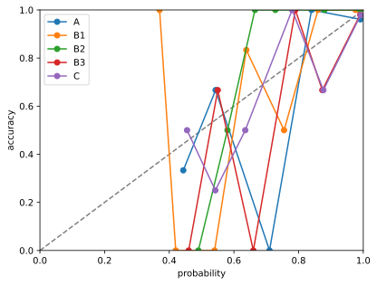
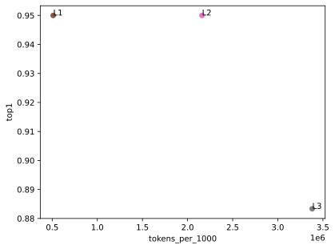
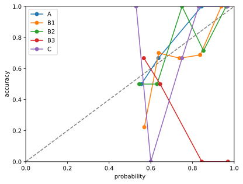
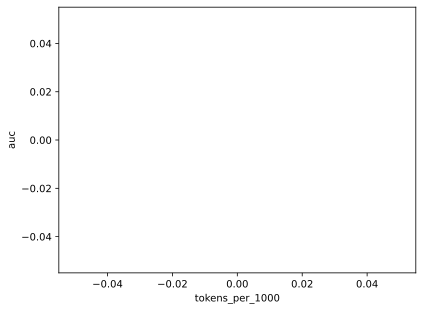
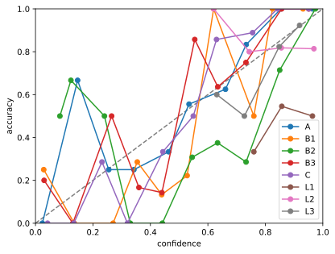
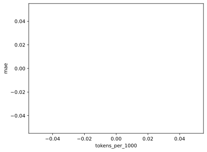

# 公開測定レポート

測定値と図のみ。入力本文は置かない。

## choice

### 条件 × 指標

| condition | n | n_primary | error_rate | top1 | top1 CI | confident_error_rate | ece | tokens_per_1000 | latency_p50_ms | latency_p95_ms |
| --- | --- | --- | --- | --- | --- | --- | --- | --- | --- | --- |
| A | 60 | 60 | 0.000 | 0.900 | [0.817, 0.967] | 0.033 | 0.052 |  | 181.446 | 246.583 |
| B1 | 60 | 60 | 0.000 | 0.933 | [0.867, 0.983] | 0.000 | 0.064 |  | 171.203 | 272.309 |
| B2 | 60 | 60 | 0.017 | 0.950 | [0.883, 1.000] | 0.000 | 0.072 |  | 174.547 | 248.964 |
| B3 | 60 | 60 | 0.000 | 0.900 | [0.817, 0.967] | 0.017 | 0.052 |  | 184.525 | 267.817 |
| C | 60 | 60 | 0.017 | 0.867 | [0.783, 0.950] | 0.017 | 0.052 |  | 195.555 | 263.887 |
| L1 | 60 | 60 | 0.000 | 0.950 | [0.883, 1.000] | 0.000 | 0.047 | 511016.667 | 3206.168 | 7203.039 |
| L2 | 60 | 60 | 0.000 | 0.950 | [0.883, 1.000] | 0.000 | 0.066 | 2160116.667 | 1375.667 | 9598.913 |
| L3 | 60 | 60 | 0.083 | 0.883 | [0.800, 0.967] | 0.000 | 0.141 | 3381527.273 | 1910.778 | 3312.982 |

### 較正

| condition | bin | bin_low | bin_high | n | mean_confidence | accuracy | ece |
| --- | --- | --- | --- | --- | --- | --- | --- |
| A | 0 | 0.000 | 0.100 | 0 |  |  | 0.052 |
| A | 1 | 0.100 | 0.200 | 0 |  |  | 0.052 |
| A | 2 | 0.200 | 0.300 | 0 |  |  | 0.052 |
| A | 3 | 0.300 | 0.400 | 0 |  |  | 0.052 |
| A | 4 | 0.400 | 0.500 | 3 | 0.423 | 0.333 | 0.052 |
| A | 5 | 0.500 | 0.600 | 3 | 0.533 | 0.667 | 0.052 |
| A | 6 | 0.600 | 0.700 | 0 |  |  | 0.052 |
| A | 7 | 0.700 | 0.800 | 1 | 0.700 | 0.000 | 0.052 |
| A | 8 | 0.800 | 0.900 | 2 | 0.830 | 1.000 | 0.052 |
| A | 9 | 0.900 | 1.000 | 51 | 0.988 | 0.961 | 0.052 |
| B1 | 0 | 0.000 | 0.100 | 0 |  |  | 0.064 |
| B1 | 1 | 0.100 | 0.200 | 0 |  |  | 0.064 |
| B1 | 2 | 0.200 | 0.300 | 0 |  |  | 0.064 |
| B1 | 3 | 0.300 | 0.400 | 1 | 0.350 | 1.000 | 0.064 |
| B1 | 4 | 0.400 | 0.500 | 1 | 0.400 | 0.000 | 0.064 |
| B1 | 5 | 0.500 | 0.600 | 3 | 0.563 | 0.667 | 0.064 |
| B1 | 6 | 0.600 | 0.700 | 4 | 0.645 | 0.750 | 0.064 |
| B1 | 7 | 0.700 | 0.800 | 2 | 0.735 | 0.500 | 0.064 |
| B1 | 8 | 0.800 | 0.900 | 2 | 0.850 | 1.000 | 0.064 |
| B1 | 9 | 0.900 | 1.000 | 47 | 0.973 | 1.000 | 0.064 |
| B2 | 0 | 0.000 | 0.100 | 0 |  |  | 0.072 |
| B2 | 1 | 0.100 | 0.200 | 0 |  |  | 0.072 |
| B2 | 2 | 0.200 | 0.300 | 0 |  |  | 0.072 |
| B2 | 3 | 0.300 | 0.400 | 0 |  |  | 0.072 |
| B2 | 4 | 0.400 | 0.500 | 1 | 0.480 | 0.000 | 0.072 |
| B2 | 5 | 0.500 | 0.600 | 2 | 0.565 | 0.500 | 0.072 |
| B2 | 6 | 0.600 | 0.700 | 3 | 0.670 | 1.000 | 0.072 |
| B2 | 7 | 0.700 | 0.800 | 4 | 0.725 | 1.000 | 0.072 |
| B2 | 8 | 0.800 | 0.900 | 8 | 0.873 | 1.000 | 0.072 |
| B2 | 9 | 0.900 | 1.000 | 41 | 0.988 | 1.000 | 0.072 |
| B3 | 0 | 0.000 | 0.100 | 0 |  |  | 0.052 |
| B3 | 1 | 0.100 | 0.200 | 0 |  |  | 0.052 |
| B3 | 2 | 0.200 | 0.300 | 0 |  |  | 0.052 |
| B3 | 3 | 0.300 | 0.400 | 0 |  |  | 0.052 |
| B3 | 4 | 0.400 | 0.500 | 2 | 0.440 | 0.000 | 0.052 |
| B3 | 5 | 0.500 | 0.600 | 3 | 0.533 | 0.667 | 0.052 |
| B3 | 6 | 0.600 | 0.700 | 1 | 0.650 | 0.000 | 0.052 |
| B3 | 7 | 0.700 | 0.800 | 1 | 0.780 | 1.000 | 0.052 |
| B3 | 8 | 0.800 | 0.900 | 3 | 0.860 | 0.667 | 0.052 |
| B3 | 9 | 0.900 | 1.000 | 50 | 0.988 | 0.980 | 0.052 |
| C | 0 | 0.000 | 0.100 | 0 |  |  | 0.052 |
| C | 1 | 0.100 | 0.200 | 0 |  |  | 0.052 |
| C | 2 | 0.200 | 0.300 | 0 |  |  | 0.052 |
| C | 3 | 0.300 | 0.400 | 0 |  |  | 0.052 |
| C | 4 | 0.400 | 0.500 | 2 | 0.435 | 0.500 | 0.052 |
| C | 5 | 0.500 | 0.600 | 4 | 0.525 | 0.250 | 0.052 |
| C | 6 | 0.600 | 0.700 | 2 | 0.620 | 0.500 | 0.052 |
| C | 7 | 0.700 | 0.800 | 2 | 0.770 | 1.000 | 0.052 |
| C | 8 | 0.800 | 0.900 | 3 | 0.867 | 0.667 | 0.052 |
| C | 9 | 0.900 | 1.000 | 46 | 0.990 | 0.978 | 0.052 |
| L1 | 0 | 0.000 | 0.100 | 0 |  |  | 0.047 |
| L1 | 1 | 0.100 | 0.200 | 0 |  |  | 0.047 |
| L1 | 2 | 0.200 | 0.300 | 0 |  |  | 0.047 |
| L1 | 3 | 0.300 | 0.400 | 0 |  |  | 0.047 |
| L1 | 4 | 0.400 | 0.500 | 0 |  |  | 0.047 |
| L1 | 5 | 0.500 | 0.600 | 2 | 0.580 | 0.500 | 0.047 |
| L1 | 6 | 0.600 | 0.700 | 1 | 0.630 | 1.000 | 0.047 |
| L1 | 7 | 0.700 | 0.800 | 1 | 0.780 | 0.000 | 0.047 |
| L1 | 8 | 0.800 | 0.900 | 3 | 0.847 | 0.667 | 0.047 |
| L1 | 9 | 0.900 | 1.000 | 53 | 0.982 | 1.000 | 0.047 |
| L2 | 0 | 0.000 | 0.100 | 0 |  |  | 0.066 |
| L2 | 1 | 0.100 | 0.200 | 0 |  |  | 0.066 |
| L2 | 2 | 0.200 | 0.300 | 1 | 0.290 | 1.000 | 0.066 |
| L2 | 3 | 0.300 | 0.400 | 0 |  |  | 0.066 |
| L2 | 4 | 0.400 | 0.500 | 1 | 0.430 | 1.000 | 0.066 |
| L2 | 5 | 0.500 | 0.600 | 1 | 0.560 | 0.000 | 0.066 |
| L2 | 6 | 0.600 | 0.700 | 0 |  |  | 0.066 |
| L2 | 7 | 0.700 | 0.800 | 3 | 0.740 | 0.333 | 0.066 |
| L2 | 8 | 0.800 | 0.900 | 0 |  |  | 0.066 |
| L2 | 9 | 0.900 | 1.000 | 54 | 0.983 | 1.000 | 0.066 |
| L3 | 0 | 0.000 | 0.100 | 0 |  |  | 0.141 |
| L3 | 1 | 0.100 | 0.200 | 0 |  |  | 0.141 |
| L3 | 2 | 0.200 | 0.300 | 0 |  |  | 0.141 |
| L3 | 3 | 0.300 | 0.400 | 2 | 0.350 | 1.000 | 0.141 |
| L3 | 4 | 0.400 | 0.500 | 1 | 0.450 | 1.000 | 0.141 |
| L3 | 5 | 0.500 | 0.600 | 2 | 0.550 | 0.500 | 0.141 |
| L3 | 6 | 0.600 | 0.700 | 2 | 0.600 | 1.000 | 0.141 |
| L3 | 7 | 0.700 | 0.800 | 2 | 0.725 | 0.500 | 0.141 |
| L3 | 8 | 0.800 | 0.900 | 21 | 0.843 | 1.000 | 0.141 |
| L3 | 9 | 0.900 | 1.000 | 25 | 0.950 | 1.000 | 0.141 |

### コスト × 精度

| condition | tokens_per_1000 | top1 | latency_p50_ms | latency_p95_ms |
| --- | --- | --- | --- | --- |
| A |  | 0.900 | 181.446 | 246.583 |
| B1 |  | 0.933 | 171.203 | 272.309 |
| B2 |  | 0.950 | 174.547 | 248.964 |
| B3 |  | 0.900 | 184.525 | 267.817 |
| C |  | 0.867 | 195.555 | 263.887 |
| L1 | 511016.667 | 0.950 | 3206.168 | 7203.039 |
| L2 | 2160116.667 | 0.950 | 1375.667 | 9598.913 |
| L3 | 3381527.273 | 0.883 | 1910.778 | 3312.982 |

## noul

### 条件 × 指標

| condition | n | n_primary | error_rate | auc | auc CI | confident_error_rate | ece | tokens_per_1000 | latency_p50_ms | latency_p95_ms |
| --- | --- | --- | --- | --- | --- | --- | --- | --- | --- | --- |
| A | 60 | 60 | 0.000 | 0.999 | [0.997, 1.000] | 0.000 | 0.045 |  | 163.801 | 231.984 |
| B1 | 60 | 59 | 0.017 | 0.962 | [0.913, 0.993] | 0.000 | 0.130 |  | 173.069 | 246.915 |
| B2 | 60 | 60 | 0.000 | 0.996 | [0.982, 1.000] | 0.000 | 0.068 |  | 162.324 | 242.857 |
| B3 | 60 | 60 | 0.000 | 0.003 | [0.000, 0.014] | 0.883 | 0.895 |  | 170.478 | 260.320 |
| C | 60 | 60 | 0.000 | 0.999 | [0.993, 1.000] | 0.000 | 0.056 |  | 168.639 | 233.699 |
| L1 | 60 | 60 | 0.000 | 0.917 | [0.844, 0.981] | 0.083 | 0.072 | 112550.000 | 3520.603 | 10655.960 |
| L2 | 60 | 58 | 0.033 | 0.983 | [0.944, 1.000] | 0.017 | 0.032 | 173741.379 | 1529.097 | 5028.846 |
| L3 | 60 | 60 | 0.000 | 1.000 | [1.000, 1.000] | 0.000 | 0.056 | 240750.000 | 1593.297 | 2736.661 |

### 較正

| condition | bin | bin_low | bin_high | n | mean_confidence | accuracy | ece |
| --- | --- | --- | --- | --- | --- | --- | --- |
| A | 0 | 0.000 | 0.100 | 0 |  |  | 0.045 |
| A | 1 | 0.100 | 0.200 | 0 |  |  | 0.045 |
| A | 2 | 0.200 | 0.300 | 0 |  |  | 0.045 |
| A | 3 | 0.300 | 0.400 | 0 |  |  | 0.045 |
| A | 4 | 0.400 | 0.500 | 0 |  |  | 0.045 |
| A | 5 | 0.500 | 0.600 | 2 | 0.555 | 0.500 | 0.045 |
| A | 6 | 0.600 | 0.700 | 3 | 0.637 | 0.667 | 0.045 |
| A | 7 | 0.700 | 0.800 | 0 |  |  | 0.045 |
| A | 8 | 0.800 | 0.900 | 5 | 0.844 | 1.000 | 0.045 |
| A | 9 | 0.900 | 1.000 | 50 | 0.965 | 1.000 | 0.045 |
| B1 | 0 | 0.000 | 0.100 | 0 |  |  | 0.130 |
| B1 | 1 | 0.100 | 0.200 | 0 |  |  | 0.130 |
| B1 | 2 | 0.200 | 0.300 | 0 |  |  | 0.130 |
| B1 | 3 | 0.300 | 0.400 | 0 |  |  | 0.130 |
| B1 | 4 | 0.400 | 0.500 | 0 |  |  | 0.130 |
| B1 | 5 | 0.500 | 0.600 | 9 | 0.569 | 0.222 | 0.130 |
| B1 | 6 | 0.600 | 0.700 | 10 | 0.638 | 0.700 | 0.130 |
| B1 | 7 | 0.700 | 0.800 | 6 | 0.738 | 0.667 | 0.130 |
| B1 | 8 | 0.800 | 0.900 | 16 | 0.837 | 0.688 | 0.130 |
| B1 | 9 | 0.900 | 1.000 | 18 | 0.938 | 1.000 | 0.130 |
| B2 | 0 | 0.000 | 0.100 | 0 |  |  | 0.068 |
| B2 | 1 | 0.100 | 0.200 | 0 |  |  | 0.068 |
| B2 | 2 | 0.200 | 0.300 | 0 |  |  | 0.068 |
| B2 | 3 | 0.300 | 0.400 | 0 |  |  | 0.068 |
| B2 | 4 | 0.400 | 0.500 | 0 |  |  | 0.068 |
| B2 | 5 | 0.500 | 0.600 | 2 | 0.545 | 0.500 | 0.068 |
| B2 | 6 | 0.600 | 0.700 | 2 | 0.630 | 0.500 | 0.068 |
| B2 | 7 | 0.700 | 0.800 | 4 | 0.750 | 1.000 | 0.068 |
| B2 | 8 | 0.800 | 0.900 | 7 | 0.853 | 0.714 | 0.068 |
| B2 | 9 | 0.900 | 1.000 | 45 | 0.962 | 1.000 | 0.068 |
| B3 | 0 | 0.000 | 0.100 | 0 |  |  | 0.895 |
| B3 | 1 | 0.100 | 0.200 | 0 |  |  | 0.895 |
| B3 | 2 | 0.200 | 0.300 | 0 |  |  | 0.895 |
| B3 | 3 | 0.300 | 0.400 | 0 |  |  | 0.895 |
| B3 | 4 | 0.400 | 0.500 | 0 |  |  | 0.895 |
| B3 | 5 | 0.500 | 0.600 | 3 | 0.567 | 0.667 | 0.895 |
| B3 | 6 | 0.600 | 0.700 | 2 | 0.645 | 0.500 | 0.895 |
| B3 | 7 | 0.700 | 0.800 | 0 |  |  | 0.895 |
| B3 | 8 | 0.800 | 0.900 | 2 | 0.845 | 0.000 | 0.895 |
| B3 | 9 | 0.900 | 1.000 | 53 | 0.970 | 0.000 | 0.895 |
| C | 0 | 0.000 | 0.100 | 0 |  |  | 0.056 |
| C | 1 | 0.100 | 0.200 | 0 |  |  | 0.056 |
| C | 2 | 0.200 | 0.300 | 0 |  |  | 0.056 |
| C | 3 | 0.300 | 0.400 | 0 |  |  | 0.056 |
| C | 4 | 0.400 | 0.500 | 0 |  |  | 0.056 |
| C | 5 | 0.500 | 0.600 | 1 | 0.530 | 1.000 | 0.056 |
| C | 6 | 0.600 | 0.700 | 1 | 0.600 | 0.000 | 0.056 |
| C | 7 | 0.700 | 0.800 | 3 | 0.750 | 0.667 | 0.056 |
| C | 8 | 0.800 | 0.900 | 2 | 0.830 | 1.000 | 0.056 |
| C | 9 | 0.900 | 1.000 | 53 | 0.968 | 1.000 | 0.056 |
| L1 | 0 | 0.000 | 0.100 | 0 |  |  | 0.072 |
| L1 | 1 | 0.100 | 0.200 | 0 |  |  | 0.072 |
| L1 | 2 | 0.200 | 0.300 | 0 |  |  | 0.072 |
| L1 | 3 | 0.300 | 0.400 | 0 |  |  | 0.072 |
| L1 | 4 | 0.400 | 0.500 | 0 |  |  | 0.072 |
| L1 | 5 | 0.500 | 0.600 | 0 |  |  | 0.072 |
| L1 | 6 | 0.600 | 0.700 | 2 | 0.620 | 1.000 | 0.072 |
| L1 | 7 | 0.700 | 0.800 | 2 | 0.750 | 0.000 | 0.072 |
| L1 | 8 | 0.800 | 0.900 | 2 | 0.840 | 0.000 | 0.072 |
| L1 | 9 | 0.900 | 1.000 | 54 | 0.988 | 0.981 | 0.072 |
| L2 | 0 | 0.000 | 0.100 | 0 |  |  | 0.032 |
| L2 | 1 | 0.100 | 0.200 | 0 |  |  | 0.032 |
| L2 | 2 | 0.200 | 0.300 | 0 |  |  | 0.032 |
| L2 | 3 | 0.300 | 0.400 | 0 |  |  | 0.032 |
| L2 | 4 | 0.400 | 0.500 | 0 |  |  | 0.032 |
| L2 | 5 | 0.500 | 0.600 | 0 |  |  | 0.032 |
| L2 | 6 | 0.600 | 0.700 | 1 | 0.650 | 1.000 | 0.032 |
| L2 | 7 | 0.700 | 0.800 | 1 | 0.720 | 1.000 | 0.032 |
| L2 | 8 | 0.800 | 0.900 | 2 | 0.850 | 0.500 | 0.032 |
| L2 | 9 | 0.900 | 1.000 | 54 | 0.990 | 1.000 | 0.032 |
| L3 | 0 | 0.000 | 0.100 | 0 |  |  | 0.056 |
| L3 | 1 | 0.100 | 0.200 | 0 |  |  | 0.056 |
| L3 | 2 | 0.200 | 0.300 | 0 |  |  | 0.056 |
| L3 | 3 | 0.300 | 0.400 | 0 |  |  | 0.056 |
| L3 | 4 | 0.400 | 0.500 | 0 |  |  | 0.056 |
| L3 | 5 | 0.500 | 0.600 | 0 |  |  | 0.056 |
| L3 | 6 | 0.600 | 0.700 | 0 |  |  | 0.056 |
| L3 | 7 | 0.700 | 0.800 | 1 | 0.780 | 1.000 | 0.056 |
| L3 | 8 | 0.800 | 0.900 | 12 | 0.850 | 1.000 | 0.056 |
| L3 | 9 | 0.900 | 1.000 | 47 | 0.972 | 1.000 | 0.056 |

### コスト × 精度

| condition | tokens_per_1000 | auc | latency_p50_ms | latency_p95_ms |
| --- | --- | --- | --- | --- |
| A |  | 0.999 | 163.801 | 231.984 |
| B1 |  | 0.962 | 173.069 | 246.915 |
| B2 |  | 0.996 | 162.324 | 242.857 |
| B3 |  | 0.003 | 170.478 | 260.320 |
| C |  | 0.999 | 168.639 | 233.699 |
| L1 | 112550.000 | 0.917 | 3520.603 | 10655.960 |
| L2 | 173741.379 | 0.983 | 1529.097 | 5028.846 |
| L3 | 240750.000 | 1.000 | 1593.297 | 2736.661 |

## score

### 条件 × 指標

| condition | n | n_primary | error_rate | mae | mae CI | spearman | spearman CI | confident_error_rate | ece | tokens_per_1000 | latency_p50_ms | latency_p95_ms |
| --- | --- | --- | --- | --- | --- | --- | --- | --- | --- | --- | --- | --- |
| A | 60 | 59 | 0.017 | 0.501 | [0.386, 0.627] | 0.618 | [0.422, 0.767] | 0.000 | 0.087 |  | 168.422 | 301.855 |
| B1 | 60 | 60 | 0.000 | 0.733 | [0.599, 0.870] | 0.636 | [0.460, 0.762] | 0.000 | 0.218 |  | 168.669 | 229.760 |
| B2 | 60 | 60 | 0.000 | 0.730 | [0.589, 0.878] | 0.616 | [0.438, 0.751] | 0.000 | 0.280 |  | 174.311 | 228.215 |
| B3 | 60 | 60 | 0.000 | 0.491 | [0.381, 0.610] | 0.660 | [0.486, 0.790] | 0.000 | 0.138 |  | 180.120 | 251.592 |
| C | 60 | 60 | 0.000 | 0.528 | [0.412, 0.655] | 0.660 | [0.485, 0.790] | 0.000 | 0.101 |  | 173.027 | 290.787 |
| L1 | 60 | 60 | 0.000 | 1.150 | [0.817, 1.483] | -0.242 | [-0.515, 0.045] | 0.383 | 0.434 | 333366.667 | 5381.076 | 15132.594 |
| L2 | 60 | 60 | 0.000 | 0.200 | [0.100, 0.317] | 0.766 | [0.620, 0.888] | 0.133 | 0.129 | 407133.333 | 4340.638 | 12076.513 |
| L3 | 60 | 60 | 0.000 | 0.400 | [0.233, 0.583] | 0.531 | [0.305, 0.725] | 0.017 | 0.089 | 495666.667 | 1755.499 | 5298.476 |

### 較正

| condition | bin | bin_low | bin_high | n | mean_confidence | accuracy | ece |
| --- | --- | --- | --- | --- | --- | --- | --- |
| A | 0 | 0.000 | 0.100 | 5 | 0.024 | 0.000 | 0.087 |
| A | 1 | 0.100 | 0.200 | 3 | 0.147 | 0.667 | 0.087 |
| A | 2 | 0.200 | 0.300 | 4 | 0.255 | 0.250 | 0.087 |
| A | 3 | 0.300 | 0.400 | 4 | 0.343 | 0.250 | 0.087 |
| A | 4 | 0.400 | 0.500 | 3 | 0.463 | 0.333 | 0.087 |
| A | 5 | 0.500 | 0.600 | 9 | 0.534 | 0.556 | 0.087 |
| A | 6 | 0.600 | 0.700 | 8 | 0.661 | 0.625 | 0.087 |
| A | 7 | 0.700 | 0.800 | 6 | 0.733 | 0.833 | 0.087 |
| A | 8 | 0.800 | 0.900 | 9 | 0.854 | 1.000 | 0.087 |
| A | 9 | 0.900 | 1.000 | 8 | 0.964 | 1.000 | 0.087 |
| B1 | 0 | 0.000 | 0.100 | 8 | 0.029 | 0.250 | 0.218 |
| B1 | 1 | 0.100 | 0.200 | 2 | 0.135 | 0.000 | 0.218 |
| B1 | 2 | 0.200 | 0.300 | 4 | 0.270 | 0.000 | 0.218 |
| B1 | 3 | 0.300 | 0.400 | 7 | 0.354 | 0.286 | 0.218 |
| B1 | 4 | 0.400 | 0.500 | 15 | 0.439 | 0.133 | 0.218 |
| B1 | 5 | 0.500 | 0.600 | 9 | 0.528 | 0.222 | 0.218 |
| B1 | 6 | 0.600 | 0.700 | 1 | 0.620 | 1.000 | 0.218 |
| B1 | 7 | 0.700 | 0.800 | 2 | 0.760 | 0.500 | 0.218 |
| B1 | 8 | 0.800 | 0.900 | 4 | 0.825 | 1.000 | 0.218 |
| B1 | 9 | 0.900 | 1.000 | 8 | 0.931 | 1.000 | 0.218 |
| B2 | 0 | 0.000 | 0.100 | 2 | 0.085 | 0.500 | 0.280 |
| B2 | 1 | 0.100 | 0.200 | 3 | 0.123 | 0.667 | 0.280 |
| B2 | 2 | 0.200 | 0.300 | 2 | 0.240 | 0.500 | 0.280 |
| B2 | 3 | 0.300 | 0.400 | 4 | 0.330 | 0.000 | 0.280 |
| B2 | 4 | 0.400 | 0.500 | 7 | 0.441 | 0.000 | 0.280 |
| B2 | 5 | 0.500 | 0.600 | 13 | 0.545 | 0.308 | 0.280 |
| B2 | 6 | 0.600 | 0.700 | 8 | 0.634 | 0.375 | 0.280 |
| B2 | 7 | 0.700 | 0.800 | 7 | 0.733 | 0.286 | 0.280 |
| B2 | 8 | 0.800 | 0.900 | 7 | 0.850 | 0.714 | 0.280 |
| B2 | 9 | 0.900 | 1.000 | 7 | 0.974 | 1.000 | 0.280 |
| B3 | 0 | 0.000 | 0.100 | 5 | 0.030 | 0.200 | 0.138 |
| B3 | 1 | 0.100 | 0.200 | 1 | 0.130 | 0.000 | 0.138 |
| B3 | 2 | 0.200 | 0.300 | 2 | 0.265 | 0.500 | 0.138 |
| B3 | 3 | 0.300 | 0.400 | 6 | 0.360 | 0.167 | 0.138 |
| B3 | 4 | 0.400 | 0.500 | 7 | 0.440 | 0.143 | 0.138 |
| B3 | 5 | 0.500 | 0.600 | 7 | 0.554 | 0.857 | 0.138 |
| B3 | 6 | 0.600 | 0.700 | 11 | 0.635 | 0.636 | 0.138 |
| B3 | 7 | 0.700 | 0.800 | 4 | 0.732 | 0.750 | 0.138 |
| B3 | 8 | 0.800 | 0.900 | 6 | 0.857 | 1.000 | 0.138 |
| B3 | 9 | 0.900 | 1.000 | 11 | 0.951 | 1.000 | 0.138 |
| C | 0 | 0.000 | 0.100 | 5 | 0.042 | 0.000 | 0.101 |
| C | 1 | 0.100 | 0.200 | 3 | 0.133 | 0.000 | 0.101 |
| C | 2 | 0.200 | 0.300 | 7 | 0.231 | 0.286 | 0.101 |
| C | 3 | 0.300 | 0.400 | 1 | 0.320 | 0.000 | 0.101 |
| C | 4 | 0.400 | 0.500 | 3 | 0.443 | 0.333 | 0.101 |
| C | 5 | 0.500 | 0.600 | 12 | 0.549 | 0.500 | 0.101 |
| C | 6 | 0.600 | 0.700 | 7 | 0.630 | 0.857 | 0.101 |
| C | 7 | 0.700 | 0.800 | 9 | 0.756 | 0.889 | 0.101 |
| C | 8 | 0.800 | 0.900 | 4 | 0.843 | 1.000 | 0.101 |
| C | 9 | 0.900 | 1.000 | 9 | 0.951 | 1.000 | 0.101 |
| L1 | 0 | 0.000 | 0.100 | 0 |  |  | 0.434 |
| L1 | 1 | 0.100 | 0.200 | 0 |  |  | 0.434 |
| L1 | 2 | 0.200 | 0.300 | 0 |  |  | 0.434 |
| L1 | 3 | 0.300 | 0.400 | 0 |  |  | 0.434 |
| L1 | 4 | 0.400 | 0.500 | 0 |  |  | 0.434 |
| L1 | 5 | 0.500 | 0.600 | 0 |  |  | 0.434 |
| L1 | 6 | 0.600 | 0.700 | 0 |  |  | 0.434 |
| L1 | 7 | 0.700 | 0.800 | 3 | 0.760 | 0.333 | 0.434 |
| L1 | 8 | 0.800 | 0.900 | 11 | 0.857 | 0.545 | 0.434 |
| L1 | 9 | 0.900 | 1.000 | 46 | 0.964 | 0.500 | 0.434 |
| L2 | 0 | 0.000 | 0.100 | 0 |  |  | 0.129 |
| L2 | 1 | 0.100 | 0.200 | 0 |  |  | 0.129 |
| L2 | 2 | 0.200 | 0.300 | 0 |  |  | 0.129 |
| L2 | 3 | 0.300 | 0.400 | 0 |  |  | 0.129 |
| L2 | 4 | 0.400 | 0.500 | 0 |  |  | 0.129 |
| L2 | 5 | 0.500 | 0.600 | 0 |  |  | 0.129 |
| L2 | 6 | 0.600 | 0.700 | 1 | 0.620 | 1.000 | 0.129 |
| L2 | 7 | 0.700 | 0.800 | 5 | 0.744 | 0.800 | 0.129 |
| L2 | 8 | 0.800 | 0.900 | 11 | 0.855 | 0.818 | 0.129 |
| L2 | 9 | 0.900 | 1.000 | 43 | 0.969 | 0.814 | 0.129 |
| L3 | 0 | 0.000 | 0.100 | 0 |  |  | 0.089 |
| L3 | 1 | 0.100 | 0.200 | 0 |  |  | 0.089 |
| L3 | 2 | 0.200 | 0.300 | 0 |  |  | 0.089 |
| L3 | 3 | 0.300 | 0.400 | 0 |  |  | 0.089 |
| L3 | 4 | 0.400 | 0.500 | 0 |  |  | 0.089 |
| L3 | 5 | 0.500 | 0.600 | 0 |  |  | 0.089 |
| L3 | 6 | 0.600 | 0.700 | 10 | 0.631 | 0.600 | 0.089 |
| L3 | 7 | 0.700 | 0.800 | 20 | 0.727 | 0.500 | 0.089 |
| L3 | 8 | 0.800 | 0.900 | 17 | 0.848 | 0.824 | 0.089 |
| L3 | 9 | 0.900 | 1.000 | 13 | 0.919 | 0.923 | 0.089 |

### コスト × 精度

| condition | tokens_per_1000 | mae | latency_p50_ms | latency_p95_ms |
| --- | --- | --- | --- | --- |
| A |  | 0.501 | 168.422 | 301.855 |
| B1 |  | 0.733 | 168.669 | 229.760 |
| B2 |  | 0.730 | 174.311 | 228.215 |
| B3 |  | 0.491 | 180.120 | 251.592 |
| C |  | 0.528 | 173.027 | 290.787 |
| L1 | 333366.667 | 1.150 | 5381.076 | 15132.594 |
| L2 | 407133.333 | 0.200 | 4340.638 | 12076.513 |
| L3 | 495666.667 | 0.400 | 1755.499 | 5298.476 |

